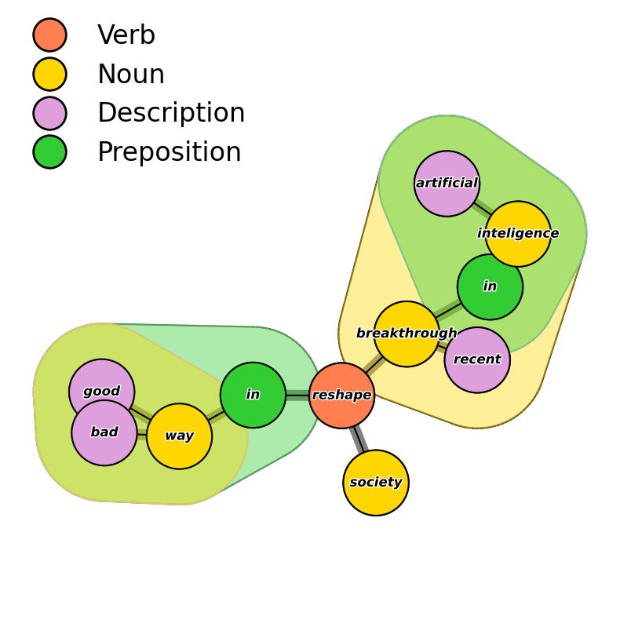

# Segram: _a framework for semantic grammar and narrative analysis_

> **Note**
> This project is still in an early stage of development,
> so one should expect significant changes in the future,
> including backward incompatible ones. That said, the general
> concepts and design principles should remain the same or be extended,
> not changed or limited. Thus, the package is suitable for experimental
> usage.

**Segram** is a software implementation of a framework for automated
semantics-oriented grammatical analysis of text data. It is implemented
in Python and based on the excellent [spacy](https://spacy.io/)
package, which is used to solve core NLP tasks such as tokenization,
lemmatization, dependency parsing and coreference resolution.

## Main use cases and features

* Automated grammatical analysis in terms of phrases/clauses focused
  on detecting actions as well as subjects and objects of those actions.

<p align="center">

</p>

* Flexible filtering and matching with queries expressible
  in terms of properties of subjects, verbs, objects, prepositions and
  descriptions applicable at the levels of individual phrases and entire
  sentences.
* Semantic-oriented organization of analyses in terms of stories
  and frames.
* Data serialization framework allowing for reconstructing all `segram`
  data after an initial parsing without access to any `spacy` language
  model.
* Structured vector similarity model based on weighted averages of
  cosine similarities between different components of phrases/sentences
  (several algorithms based on somewhat different notions of what
  it means for sentences or phrases to be similar are available).
* Structured vector similarity model for comparing documents in terms
  of sequentially shifting semantics.
* Hypergraphical representation of grammatical structure of sentences.

<p align="center">

</p>


## Core requirements

| Package                  | Version            |
| ------------------------ | ------------------ |
| `python`                 | `>=3.11`           |
| `spacy`                  | `>=3.4`            |

The required Python version will not change in the future releases
for the foreseeable future, so before the package becomes fully
mature the dependency on `python>=3.11` will not be too demanding
(although it may be bumped to `>=3.12` as the new release is expected
soon as of time of writing - 29.09.2023).

### Core requirements (coreference resolution)

`Segram` comes with a coreference resolution component based on an
experimental model provided by `spacy-experimental` package.
However, both at the level of `segram` and `spacy` this is currently
an experimental feature, which comes with a significant price tag attached.
Namely, the acceptable `spacy` version is significantly limited
(see the table below). However, as `spacy-experimental` gets integrated
in the `spacy` core in the future, these constraints will be relaxed.


| Package                  | Version            |
| ------------------------ | ------------------ |
| `spacy`                  | `>=3.4,<3,5`       |
| `spacy-experimental`     | `0.6.3`            |
| `en_coreference_web_trf` | `3.4.0a2`          |


## Supported models and languages

Currently, **only English is supported** and `segram` was tested on models:

* `en_core_web_trf>=3.4.1` (transformer-based model for the general NLP)
* `en_core_web_lgl>=3.4.1` (used for context-free word vectors)
* `en_coreference_web_trf==3.4.0a2` (for coreference resolution)


## Installation


### PyPI

```bash
pip install segram
python -m download en_core_web_trf
python -m download en_core_web_lg  # skip if word vectors are not needed
```

#### With coreference resolution

```bash
pip install segram[coref]
python -m download en_core_web_trf
python -m download en_core_web_lg  # skip if word vectors are not needed
pip install https://github.com/explosion/spacy-experimental/releases/download/v0.6.1/en_coreference_web_trf-3.4.0a2-py3-none-any.whl
```

#### With GPU acceleration

```bash
pip install segram[gpu]
# OR in the case when coreference resolution is required
pip install segram[coref,gpu]
```

The rest of commands should remain the same depending on whether
coreference installation or not is used.

### Github (development version)

```bash
pip install git+ssh://git@github.com/sztal/segram.git
```

#### With coreference resolution

## Basic usage

```python
import spacy
nlp = spacy.load("en_core_web_trf")
nlp.add_pipe("segram", config={
    "vectors": "en_core_web_lg"
})
nlp.add_pipe("segram_coref")

# Get standard 'spacy' document
doc = nlp(
    "The merchants travelled a long way to buy spices "
    "and rest in our taverns."
)
# Convert it to segram 'grammar' document
doc = doc._.segram
doc
```

The code above parses the text using `spacy` and additionally applies
further processing pipeline components defined by `segram`. They inject
many additional functionalities into standard `spacy` tokens.
In particular, `Doc` instances are enhanced with a special extension
property `._.segram`, which converts them to `segram` grammar documents.
Note that the printing results is different now - the output is colored!

The colors denote the partition of the document into **components**,
which are groups of related tokens headed by a syntactically and/or
semantically important token. They are divided into four distinct types
which are marked with different colors when printing to the console.
The following (default) color scheme is:

* <span style="color:orange">**Noun components**</span> `#FF0000`
* <span style="color:red">**Verb components**</span> `#FFA500`
* <span style="color:violet">**Description components**</span> `#EE82EE`
* <span style="color:limegreen">**Preposition components**</span> `#32CD32`

Components are further organized into phrases, which are higher-order
and more semantically-oriented units. Crucially, while components are
non-overlapping and form a partition of the sentence, the phrases
can be nested in each other and form a directed acyclic graph (DAG).

## Development

### Setting up environment

The [Github repository](https://github.com/sztal/segram)
provides [conda](https://docs.conda.io/en/latest/) environment files
for setting up development/testing environment. This installs also
testing dependencies such as [pytest](https://docs.pytest.org/en/7.4.x/),
which is used for running unit tests.

```bash
git clone git@github.com:sztal/segram.git
cd segram
conda env create -f environment.yml # default env name is 'segram'
conda activate segram
python -m spacy download en_core_web_trf
python -m spacy download en_core_web_lg
pip install --editable .
```

### Setting up environment (with coref)

```bash
git clone git@github.com:sztal/segram.git
cd segram
conda env create -f environment-coref.yml # default env name is 'segram'
# In this case the versions of all language models are fixed
# so they are installed automatically with the rest of the dependencies
conda activate segram
pip install --editable .
```

### Testing

Currently, `segram` is only moderately tested with a unit coverage rate
of about 70%. This will be improved in the future releases.

```
pytest          # run unit tests
coverage run    # run unit tests and gather coverage statistics
coverage report # show coverage report
```


### Contribution

1. [Fork](https://github.com/sztal/segram/fork) the `segram`
   repo on GitHub.
2. Clone your fork locally::

```bash
git clone git@github.com:your_name_here/segram.git
```

3. Create a branch for local development::

```bash
git checkout -b name-of-your-bugfix-or-feature
```

Now you can make your changes locally.

4. When you're done making changes, check that your changes pass style
   and unit tests.

5. Commit your changes and push your branch to GitHub::

    $ git add .
    $ git commit -m "Your detailed description of your changes."
    $ git push origin name-of-your-bugfix-or-feature

6. Submit a pull request through the GitHub website.


### Makefile

`Makefile` defines many commands useful during development
(see the content of the file). However, Windows users may need
to modify it a bit to make it work.

Below is the list of commands most useful for development:

* `make clean`
  * Remove all build artifacts and cache files. Good to run this after
    changing `pyproject.toml` or other packaging configuration.
* `make gzip-jsons` and `make gunzip-jsons`
  * compress and decompress `.json` resource files contained distributed
    with the package source code (they store patterns used to customize
    lemmatizers etc. and data for building cases used in unit tests).
* `make list-deps`
  * Runs a regular expression over all `segram` source files and lists
    explicit dependencies (`import` statements) used in the code.


## Feedback

If you have any suggestions or questions about `segram` feel free to email
me at `<stalaga@protonmail.com>`.

If you encounter any errors or problems, please also let me know!
[Open an Issue](https://github.com/sztal/segram/issues)
in the [GitHub repository](https://github.com/sztal/segram).


Authors
=======

* Szymon Talaga, <stalaga@protonmail.com>
